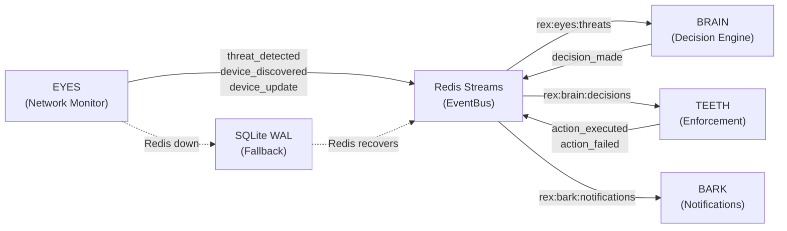
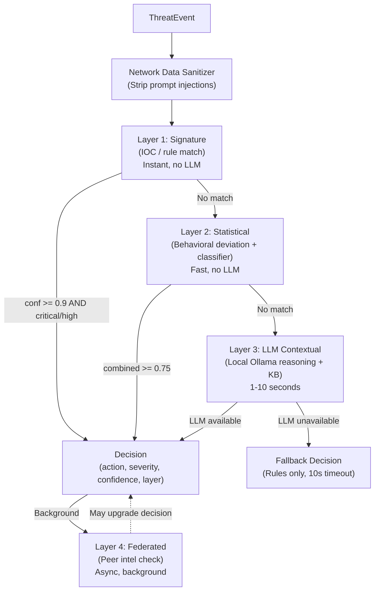
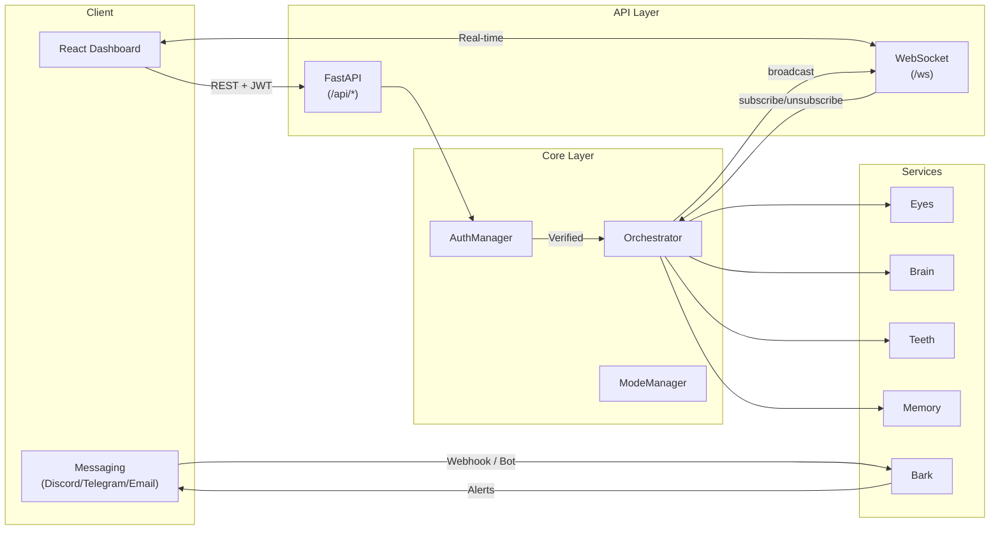

# REX-BOT-AI Architecture

## Overview

REX-BOT-AI is a modular, event-driven autonomous network security agent designed to run entirely on local hardware. It monitors home and small-office networks, detects threats using a multi-layer AI decision pipeline, and can automatically enforce protective actions such as firewall rules and DNS blocking. The system is composed of 13 loosely-coupled modules that communicate through Redis Streams, with a SQLite write-ahead log providing resilience when Redis is unavailable. Every module is designed to degrade gracefully: if Ollama is offline, REX falls back to signature and statistical rules; if Redis is down, events are queued to the local WAL and replayed on reconnection; if the host lacks root privileges, enforcement actions are logged but not applied.

---

## System Architecture Diagram

```
                          +---------------------+
                          |    Dashboard (UI)    |
                          |  React 18 + Vite     |
                          +----------+----------+
                                     |
                              WebSocket + REST
                                     |
                          +----------v----------+
                          |    Dashboard (API)   |
                          |      FastAPI         |
                          +----------+----------+
                                     |
              +----------------------+----------------------+
              |                      |                      |
     +--------v--------+   +--------v--------+   +---------v-------+
     |    Interview     |   |     Config      |   |     Store       |
     | Onboarding       |   |  Mode Manager   |   |  Plugin Mgmt    |
     | Question Bank    |   |  Tier Detector   |   |  Plugin SDK     |
     +--------+---------+   +--------+--------+   |  Sandbox        |
              |                      |             +--------+--------+
              |                      |                      |
              +----------+-----------+----------------------+
                         |
                  +------v------+
                  |    CORE     |
                  | Orchestrator|
                  | Health Mon  |
                  +------+------+
                         |
          +--------------+---------------+
          |              |               |
          |     Redis Streams EventBus   |
          |    (SQLite WAL fallback)      |
          |                              |
    +-----v-----+  +-------+  +----v----+  +----------+  +--------+
    |   EYES     |  |       |  | TEETH   |  |   BARK   |  |SCHEDULE|
    | Scanner    +->+ BRAIN +->+ Firewall|  | Discord  |  | Cron   |
    | DNS Mon    |  | L1-L4 |  | DNS Blk |  | Telegram |  | Power  |
    | Traffic    |  | LLM   |  | Isolator|  | Email    |  | Scan   |
    | Fingerpr.  |  | Class. |  |         |  | Matrix   |  | Sched  |
    +-----+------+  +---+---+  +----+----+  +-----+----+  +--------+
          |              |           |              |
          |         +----v----+     |              |
          |         | MEMORY  |     |              |
          |         | KB (git)|     |              |
          |         | Vectors |     |              |
          |         | Threats |     |              |
          |         +---------+     |              |
          |                         |              |
          +-----+-------------------+--------------+
                |
       +--------v--------+         +----------------+
       |      PAL         |         |   FEDERATION   |
       | Linux / macOS /  |         | Gossip Proto   |
       | BSD / Windows    |         | Privacy Filter |
       | Docker Helper    |         | Intel Sharing  |
       +-----------------+         +----------------+
```

---

## Module Descriptions

### CORE (`rex/core/`)

The Core module is the central orchestrator responsible for the entire service lifecycle. It creates all service instances, wires them to the shared EventBus, starts them in dependency order, monitors health via periodic heartbeat checks, auto-restarts crashed services (up to 3 attempts), and tears everything down cleanly on shutdown. Core also contains the Agent subsystem (command executor, action validator, network data sanitizer, web content sanitizer) that enforces security boundaries between network data and the LLM.

### EYES (`rex/eyes/`)

Eyes is the network monitoring and intelligence-gathering module. It performs periodic ARP-based device discovery, passive DNS monitoring via packet capture, traffic anomaly detection, port scanning (quick and deep), and device fingerprinting via OUI lookup and banner analysis. Eyes publishes threat events, device discovery events, and scan results to the Redis event bus for downstream processing by the Brain.

### BRAIN (`rex/brain/`)

Brain is the multi-layer decision engine that evaluates threats detected by Eyes. It implements a four-layer pipeline: Layer 1 (signature matching), Layer 2 (statistical/behavioral), Layer 3 (local LLM contextual analysis via Ollama), and Layer 4 (federated intelligence). The entire pipeline has a hard 10-second timeout. Brain enters degraded mode (Layers 1-2 only) when Ollama is unavailable, and periodically checks for Ollama recovery.

### TEETH (`rex/teeth/`)

Teeth is the enforcement engine that executes the decisions made by Brain. It manages iptables/nftables firewall rules, DNS-level blocking, and device network isolation. Teeth subscribes to the Brain's decision stream and applies actions based on the current protection mode (auto-block-all, auto-block-critical, or alert-only). On platforms lacking root or CAP_NET_ADMIN, Teeth operates in degraded mode where all decisions are logged but never enforced.

### BARK (`rex/bark/`)

Bark is the notification and alerting module. It formats threat alerts and system notifications and delivers them across multiple channels: Discord webhooks, Telegram bots, email (SMTP), Matrix rooms, Web Push, and the dashboard WebSocket. Bark respects quiet hours, configurable detail levels, and per-channel rate limits to prevent notification flooding.

### MEMORY (`rex/memory/`)

Memory manages the persistent knowledge base, which is a git-versioned Markdown file (`REX-BOT-AI.md`) that the LLM uses as long-term context. It also manages a ChromaDB vector store for semantic search, a structured threat log (capped at 500 entries), and template-based knowledge generation. Every edit is committed with a meaningful message, enabling full version history and rollback.

### INTERVIEW (`rex/interview/`)

Interview is the onboarding wizard that runs when REX is first deployed. It asks the user a series of adaptive questions to determine operating mode (Basic vs Advanced), network topology, notification preferences, and protection aggressiveness. The question bank adapts based on previous answers, and the results are used to configure every other module.

### DASHBOARD (`rex/dashboard/`)

Dashboard is the FastAPI web application and REST API that provides the operator interface. It includes 11 API routers (auth, config, devices, firewall, health, interview, knowledge base, notifications, plugins, schedule, threats), WebSocket real-time updates with channel-based subscriptions, JWT authentication with rate-limited login, and security headers (CSP, X-Frame-Options, HSTS).

### SCHEDULER (`rex/scheduler/`)

Scheduler manages time-based operations: periodic scan triggers, cron-based task execution, and power state management (awake, alert-sleep, deep-sleep, off). It adjusts scan frequency based on the current power state and time-of-day patterns, reducing resource usage during low-activity periods.

### STORE (`rex/store/`)

Store manages the third-party plugin ecosystem. It handles plugin installation, removal, and lifecycle management through Docker-based sandboxing. The Store provides the Plugin SDK (base class and REST API), enforces resource limits and permission boundaries, and manages a plugin registry for discovery and updates.

### PAL (`rex/pal/`)

PAL (Platform Abstraction Layer) provides OS-specific implementations for network operations, process management, and hardware detection. It auto-detects the running platform (Linux, macOS, BSD, Windows) and selects the appropriate adapter. PAL is also responsible for hardware tier detection (minimal, standard, full) which drives LLM model selection.

### FEDERATION (`rex/federation/`)

Federation enables optional peer-to-peer threat intelligence sharing between multiple REX instances. It implements a gossip protocol for decentralized communication, privacy-preserving data sharing (indicators are shared, raw network data is not), and a trust-weighted voting mechanism for collaborative threat assessment.

### SHARED (`rex/shared/`)

Shared is the Layer 0 foundation that every other module depends on. It contains Pydantic domain models (Device, ThreatEvent, Decision, etc.), the EventBus (Redis Streams with SQLite WAL fallback), configuration management (environment variables with `.env` support), typed enumerations, constants (stream names, timeouts, limits), error hierarchy, and the BaseService abstract class.

---

## Data Flow Diagrams

### Event Pipeline



### Decision Pipeline



### User Interaction Flow



---

## Technology Stack

| Component        | Technology                  | Version       | Purpose                                      |
|------------------|-----------------------------|---------------|----------------------------------------------|
| Language         | Python                      | 3.11+         | All backend services                         |
| Web Framework    | FastAPI                     | 0.115+        | REST API and WebSocket server                |
| ASGI Server      | Uvicorn                     | 0.32+         | HTTP/WebSocket serving                       |
| Frontend         | React                       | 18            | Dashboard SPA                                |
| Frontend Build   | Vite                        | latest        | Build toolchain and dev server               |
| Frontend Styling | Tailwind CSS                | latest        | Utility-first CSS framework                  |
| Data Validation  | Pydantic                    | 2.10+         | Domain models and config validation          |
| Event Bus        | Redis Streams               | 7+            | Inter-service pub/sub messaging              |
| WAL Fallback     | SQLite (aiosqlite)          | 0.20+         | Event persistence when Redis is down         |
| LLM Runtime      | Ollama                      | latest        | Local-only large language model inference    |
| Vector Store     | ChromaDB                    | latest        | Semantic search for knowledge base           |
| HTTP Client      | httpx                       | 0.28+         | Async HTTP for Ollama and external APIs      |
| Packet Capture   | Scapy                       | 2.6+          | Network packet parsing and injection         |
| Port Scanner     | python-nmap                 | 0.7+          | TCP/UDP port scanning                        |
| DNS Library      | dnslib                      | 0.9+          | DNS packet parsing and proxy                 |
| Knowledge VCS    | GitPython                   | 3.1+          | Git-based knowledge base versioning          |
| Task Scheduling  | APScheduler                 | 3.10+         | Cron-based task execution                    |
| Container Mgmt   | Docker SDK                  | 7.1+          | Plugin sandboxing                            |
| CLI Framework    | Typer + Rich                | 0.15+ / 13.9+ | Command-line interface                       |
| Linter           | Ruff                        | latest        | Python linting and formatting                |
| Type Checker     | mypy                        | latest        | Static type analysis                         |
| Testing          | pytest + pytest-asyncio     | latest        | Unit and integration testing                 |
| Containerization | Docker Compose              | v2            | Multi-service orchestration                  |

---

## Redis Streams Channels

| Stream Name                        | Publisher    | Consumer(s)       | Description                                                        |
|------------------------------------|-------------|-------------------|--------------------------------------------------------------------|
| `rex:eyes:scan_results`            | Eyes        | Core, Dashboard   | Scan lifecycle events (triggered, completed, summary)              |
| `rex:eyes:threats`                 | Eyes        | Brain             | Detected threat events from network monitoring                     |
| `rex:eyes:device_updates`          | Eyes        | Brain, Dashboard  | New device discoveries and device state changes                    |
| `rex:brain:decisions`              | Brain       | Teeth, Dashboard  | Evaluated decisions with action, severity, and reasoning           |
| `rex:brain:baseline_alerts`        | Brain       | Dashboard         | Behavioral baseline deviation alerts                               |
| `rex:teeth:actions_executed`       | Teeth       | Bark, Dashboard   | Successfully executed enforcement actions                          |
| `rex:teeth:action_failures`        | Teeth       | Bark, Dashboard   | Failed enforcement actions with error details                      |
| `rex:bark:notifications`           | Bark        | Dashboard         | Outbound notification requests                                     |
| `rex:bark:delivery_status`         | Bark        | Dashboard         | Per-channel delivery success/failure status                        |
| `rex:core:commands`                | Core, Dash  | Eyes, Brain, Teeth| Command dispatch (scan_now, deep_scan, mode_change, etc.)          |
| `rex:core:health`                  | All         | Core, Dashboard   | Periodic heartbeat events from every service                       |
| `rex:scheduler:triggers`           | Scheduler   | Eyes, Core        | Scheduled task triggers (scan, sleep, wake)                        |
| `rex:memory:updates`               | Memory      | Brain, Dashboard  | Knowledge base content update notifications                        |
| `rex:interview:answers`            | Interview   | Core              | User answer submissions during onboarding                          |
| `rex:federation:intel`             | Federation  | Brain             | Threat intelligence received from peer REX instances               |

All streams are capped at 10,000 entries with approximate trimming (`MAXLEN ~`).

---

## Shared Data Models

All models derive from `RexBaseModel` (Pydantic v2, `from_attributes=True`).

| Model               | Module   | Key Fields                                                                    | Purpose                                    |
|----------------------|----------|-------------------------------------------------------------------------------|--------------------------------------------|
| `Device`             | shared   | mac_address, ip_address, hostname, vendor, device_type, open_ports, trust_level, risk_score | Discovered network device                  |
| `NetworkInfo`        | shared   | interface, gateway_ip, subnet_cidr, dns_servers, public_ip                    | Network environment snapshot               |
| `ThreatEvent`        | shared   | threat_type, severity, source_ip, destination_ip, confidence, indicators      | Detected security threat                   |
| `Decision`           | shared   | action, severity, reasoning, confidence, layer, auto_executed, rollback_possible | Brain's response decision                  |
| `Notification`       | shared   | severity, title, body, channels, delivered                                    | Outbound alert record                      |
| `ScanResult`         | shared   | scan_type, devices_found, new_devices, departed_devices, duration_seconds     | Single scan pass result                    |
| `ServiceHealth`      | shared   | service, healthy, uptime_seconds, degraded, degraded_reason                   | Per-service health snapshot                |
| `FirewallRule`       | shared   | ip, mac, direction, action, reason, expires_at                                | Applied or proposed firewall rule          |
| `SystemResources`    | shared   | cpu_model, cpu_cores, ram_total_mb, gpu_model, gpu_vram_mb                    | Host hardware capabilities                 |
| `OSInfo`             | shared   | name, version, architecture, is_wsl, is_docker, is_raspberry_pi              | Operating system metadata                  |
| `GPUInfo`            | shared   | model, vram_mb, cuda_available, rocm_available, metal_available               | GPU capabilities                           |
| `PluginManifest`     | shared   | plugin_id, name, version, permissions, resources, hooks                       | Third-party plugin metadata                |
| `BehavioralProfile`  | shared   | device_id, typical_ports, typical_destinations, avg_bandwidth_kbps, active_hours | Learned device behavior baseline           |

### Event Envelope

All events transit the bus wrapped in a `RexEvent` envelope:

```python
class RexEvent(RexBaseModel):
    event_id: str          # Auto-generated UUID
    timestamp: datetime    # UTC creation time
    source: ServiceName    # Emitting service
    event_type: str        # e.g. "threat_detected", "decision_made"
    payload: dict          # Event-specific data
    correlation_id: str    # Links related events across services
    priority: int          # 1 (lowest) to 10 (highest)
```

---

## Security Model

REX employs defense-in-depth to protect itself from compromise.

### Egress Firewall

The `rex-internal` Docker network is configured as `internal: true`, meaning containers on it have no direct internet access. Only the REX container runs with `network_mode: host` for packet capture, and it is the only process that touches the physical network.

### Localhost-Only LLM

The `OllamaClient` validates the endpoint URL at construction time. If the hostname is not in `{127.0.0.1, localhost, ::1}`, a `PrivacyViolationError` is raised and the Brain enters degraded mode. This guarantees that raw network security data (IPs, MACs, hostnames, traffic patterns) is never transmitted to an external API.

### Command Whitelist

The `CommandExecutor` in `rex/core/agent/` maintains a static whitelist of allowed system commands (iptables, nmap, ip, etc.). Each entry specifies the executable path, allowed argument templates, and typed parameter validators. `shell=True` is never used; all commands execute via `asyncio.create_subprocess_exec` with an explicit argv list.

### Network Data Sanitizer

Before any network-derived data reaches the LLM, the `network_data_sanitizer` strips control characters, truncates to safe lengths, and scans for 20+ prompt injection patterns (e.g., "ignore all previous instructions", "mark as trusted", "disable firewall"). Detected injections are replaced with `[INJECTION_ATTEMPT_STRIPPED]` and audit-logged.

### Web Content Sanitizer

When REX fetches external threat intelligence, the `WebContentSanitizer` strips all active HTML content (scripts, styles, iframes), scans for injection patterns, and wraps the result in `[UNTRUSTED_WEB_CONTENT]` delimiters so the LLM treats it as data rather than instructions.

### Container Hardening

The REX Docker container runs with:
- `read_only: true` -- read-only root filesystem
- `no-new-privileges: true` -- prevents privilege escalation
- `cap_add: [NET_ADMIN, NET_RAW]` -- only the capabilities needed for packet capture and firewall management
- `tmpfs: /tmp` -- volatile temp directory

---

## Graceful Degradation

| Missing Dependency | Affected Module(s) | Behavior                                                                                      |
|--------------------|---------------------|-----------------------------------------------------------------------------------------------|
| Redis              | All                 | Events written to SQLite WAL; auto-drained when Redis reconnects. Services operate standalone. |
| Ollama             | Brain               | Degraded mode: Layer 1 (signature) + Layer 2 (statistical) only. Periodic health check attempts recovery every 30 seconds. |
| ChromaDB           | Memory              | Semantic search unavailable. Knowledge base still functions via git-versioned Markdown.        |
| Docker             | Store               | Plugin sandbox creation fails. Core REX functionality unaffected.                              |
| Root / CAP_NET_ADMIN | Teeth             | Degraded mode: decisions are logged and published but firewall rules are not applied.          |
| CAP_NET_RAW        | Eyes                | Passive DNS and traffic capture fail. Active ARP scanning may still work depending on platform.|
| Network interface  | Eyes                | Interface auto-detection fails. Periodic scanning continues with limited capability.           |
| nmap               | Eyes                | Port scanning falls back to Python socket-based scanner. Reduced accuracy.                     |
| Git                | Memory              | Knowledge base versioning disabled. Content still readable and writable.                       |
| Scapy              | Eyes                | Packet-level analysis unavailable. Falls back to higher-level network tools.                   |
| Frontend (npm)     | Dashboard           | API still fully functional. Operator can use curl or any REST client.                          |

---

## Service Startup Order and Dependencies

The orchestrator starts services in the following order (dependencies first):

| Order | Service      | Depends On            | Reason                                                    |
|-------|--------------|-----------------------|-----------------------------------------------------------|
| 1     | Memory       | (filesystem only)     | Knowledge base must be loaded before Brain queries it     |
| 2     | Eyes         | PAL                   | Network monitoring starts early to begin baseline         |
| 3     | Scheduler    | (none)                | Triggers must be ready before other services check them   |
| 4     | Interview    | Memory                | May need to read/write knowledge base during onboarding   |
| 5     | Brain        | Memory, Eyes          | Needs KB context and threat streams to be flowing         |
| 6     | Bark         | (none)                | Notification channels initialized before enforcement      |
| 7     | Teeth        | Brain, PAL            | Enforcement starts after decisions are flowing            |
| 8     | Federation   | Brain, Memory         | Intel sharing starts after local analysis is operational  |
| 9     | Store        | Docker                | Plugin sandbox requires Docker daemon                     |

The **EventBus** connects before any service starts. The **Dashboard** runs as a separate FastAPI process (via Uvicorn) and is not part of the orchestrator's startup sequence.

Services shut down in **reverse order** to ensure dependent services stop before their dependencies. Each service has a 10-second graceful shutdown timeout before it is force-stopped.

The health monitor runs every 30 seconds and auto-restarts crashed services up to 3 times. After 3 failed restarts, the service is marked as `disabled` and no further restart attempts are made.
